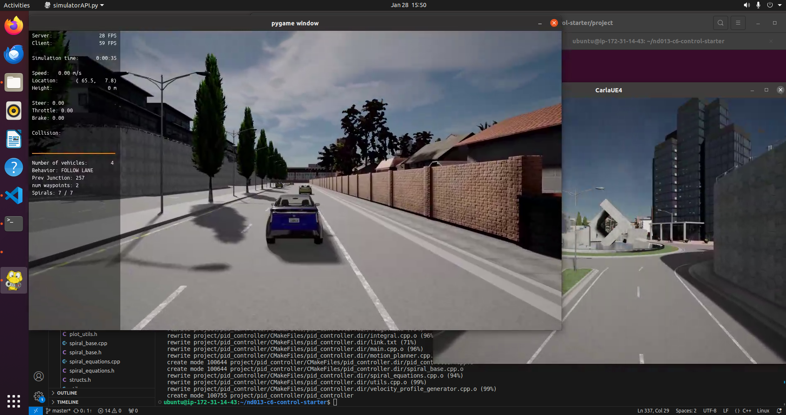
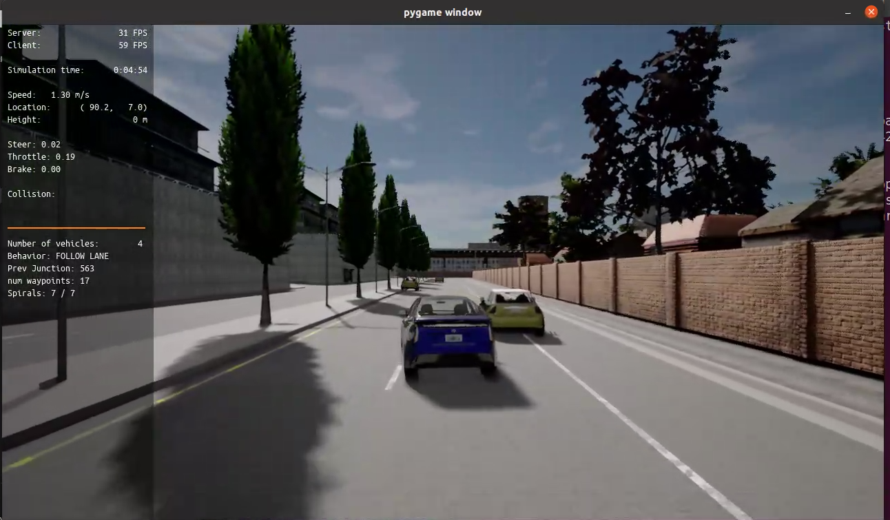
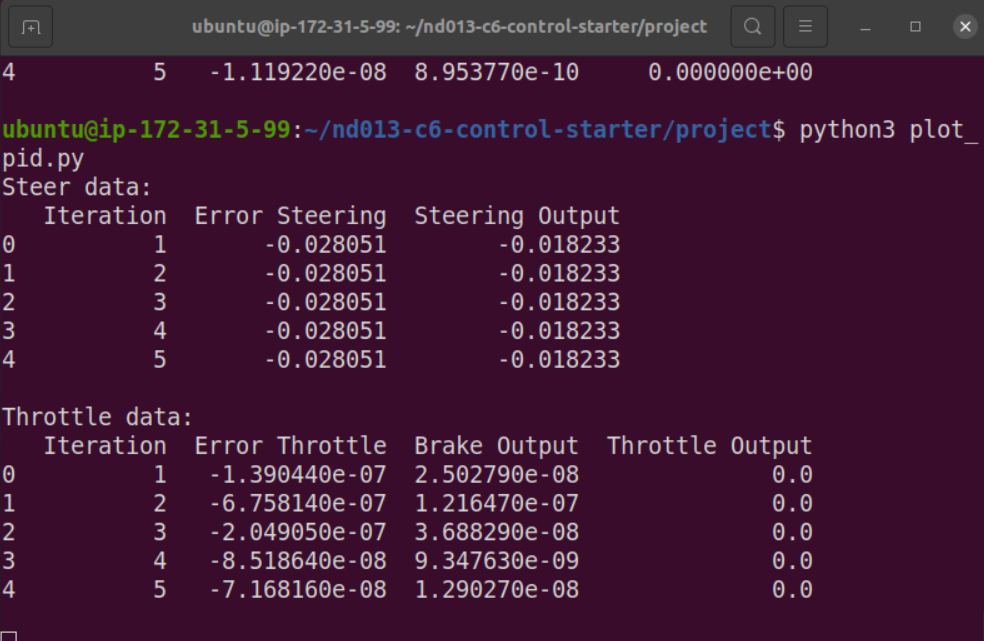
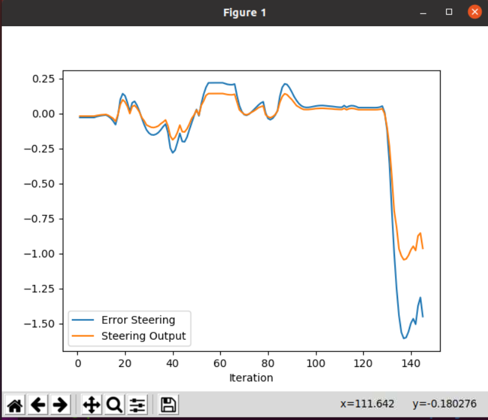
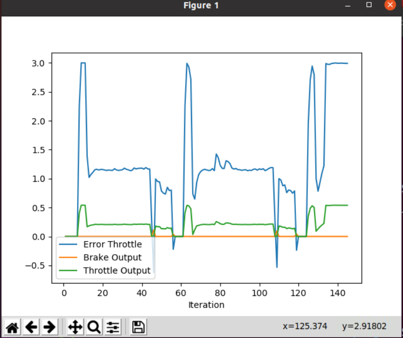

# Project Report

## Setup instructions
Follow the setup instructions of the main [README.md](./README.md) file, up to point 7, where instead of the suggested command you can also add arguments that set up the tuning parameters for the controllers (respectively, Steer: Kp, Ki, Kd, Throttle: Kp, Ki, Kd, Steer Lookahead). The example below sets the params to the best combination I found (they are also set as default so you can run it with no arguments):

```bash
./run_main_pid.sh 0.22 0.0 0.02 0.1 0.0004 0.02 0
```

## Step 1 completion
The code builds and runs as it can be seen in the below screenshot:



## Step 4
I was able to tune the controllers to make the vehicle overtake the first vehicle. 




### Steering controller

As we can see there is a decent tracking for more than 120 steps, after that a huge error suddently appears and the controller tries to track it. In my opinion this is not a controller issue but a planning issue, as this huge step error can be justified by the planner deciding to switch spiral set as reference trajectory. Indeed to support this theory the vehicle tries to turn over the curb and trees into the other lane, this behavior is not justified by bad control performances, it has to do with the way the error is calulated, and therefore with the reference that is given as input.

Also note that the parameter for the integral component was set to 0. This was necessary since the planning module would sometimes set the vehicle to a stopped state in the middle of manouvers, in practive this means that the lateral error controller would keep on integrating and eventually diverge. I tried to counter this effect with the implementation of an antiwindup logic, but it still was not enough, a more effective option would be to reset the controllers if the planner gets set in specific states but I did not implement it.

### Throttle controller

The throttle tracking performance is decent but effectively good enough for the vehicle to overtake the first obstacle. Effectively we can see that the error starts with a step like shape, as expected, and then seems to converge to a stable value, at least until a new reference is given. This problem could be resolved with a higher value on the integral components whose main role is to guarantee steady state convergeance, but I found it hard to tune the integral with something that would result in reliable and repeatable behavior given the problem I decribed above.

## Final considerations
When tackling a control problem and its tuning I would separate as much as possible the effects of the various modules of the autonomy stack. 
Given the particular structure of this control approach there is no need to include the planning or perception module in the development and tuning phase of the controller: since this controller uses only a trajectory as reference to track and has no direct involvement in the task of avoiding obstacle it would be better and easier to perform the tracking on a set of static reference trajectories, without the need to close the full loop as it was done in this project.
Of course eventually the loop should be closed and checked and verified that the interactions between modules are satisfactory (for example I would need to make sure that the avarage controller error is compatible with the minimum distance from obstacle required in the planner).

Moreover I would also separate the longitudinal and lateral tuning steps, instead the presence of the obstacles in the scenario makes it difficult to decouple the two as for example crashing into an obstacle due to bad performances of the lateral control will result in no exploration of the longitudinal tuning.

So for these reasons in order to set up a tuning procedure that is automatic or at least allows for better control over the results I would set two different sets of tests, a first one where we focus on the throttle control, for example by creating a scenario with no obstacles and directly controlling the steering to act as a disturb on the longitudinal dynamics but with no need to avoid obstacles. Then once the longitudinal control is satisfactory I would tune the lateral controller in a scenario with specific manouveres that could imitate the obstacle avoidance problem.

In both cases the twiddle algorithm is a good way to set up automatic tuning in simulation that should result in good performances. But then in the real world it might be necessary to do some more tuning to also consider the driving feel, as it's not as easy to express the desired driving behavior as a cost function. To give a practical example, one could set the twiddle to make decisions based on the overall error which makes perfect sense from a control standpoint, but it might result in a controller that is too jerky while a preferred behavior could be steady increase in acceleration.

Moreover it is not my preference to use a PID in the way it was done in the project because it's not based on a physical model and it's trying to track an error with a control variable that are not directly intertwined. For example in the physical model for the longitudinal dynamic, the throttle as an effect on the engine torque and speed that has an effect on the vehicle acceleration that has an effect on the velocity, so between those two variables (velocity and throttle) there is a series on non-linear transformations that are not considerable by the PID (which is a linear system). The same consideration goes for the steering system, so it is generally my preference to develop a physical model that has a strong way to connect the control variable to the reference variable.
Controllers like Stanley are availible for the lateral component and considering the engine curves could create a strong link between throttle and acceleration. This does not mean that PID are not useful, quite the opposite, they can still be used as the core of the error tracking but they are signficiantly more effective and easier to tune if one has to tracck the same type of variable. A practical example could be to have a  PID that tries to track a velocty error but generates acceleration references, instead of throttle command, then is the job of the physical model to convert that acceleration reference into a throttle.
Finally, using physical models, if availible, is also useful to understand good initialization values for the controllers, as one can calculate the TF of the closed loop system and at least get a theorethical bandwidth as a function of those parameters.<v>